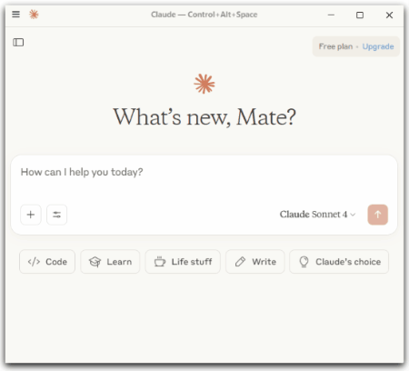
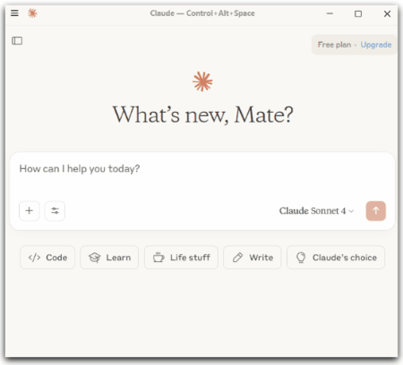

# 🐾 Part 1: MCP Server Workshop: Animal Rescue Edition

Welcome! In this workshop, we’ll explore what an MCP server is, how it connects to AI models like Claude, and how to use tools and prompts to build a smart backend — all while helping match humans with adoptable pets 🐕🐍🐔

You’ll be using the **TypeScript MCP SDK**, but don’t worry if you're not familiar with **TypeScript** — this workshop focuses on understanding  **how MCP servers work**, not mastering the code 😉.

---

## 🧩 Part 1: Set Up Your Server & List Animals

### 1. 🚀 Clone the repo via your terminal/command line of choice

```bash
git clone https://github.com/DevOps-Represent/mcp-server-workshop.git
cd typescript/animal-rescue-mcp-server
```

### 2. 📁 Repo Overview

Open your newly cloned repo in your IDE of choice and let's take a look at what's inside the **Typescript** version of this workshop.  
In the `src` folder you'll find:

* 📄 `index.ts`: Your main entry point — this starts your server and registers the tools - this is where you'll be working the most.
* 📄 `animal-rescue-service.ts`: This file contains some pre-built logic for the workshop — like functions to get animal data and schemas that describe what a valid animal looks like.
  * We’ve already defined things like:
    * **animalSchema**: What each animal object includes (name, type, medical needs, etc.)
    * **AnimalRescueService**: A helper class with methods to list animals, find them by name or ID, and simulate adoptions.
* 📄 `animal-data.ts`: Static JSON-like data that contains info on adoptable pets

#### Imports

**📦 index.ts Import Descriptions**

```ts
import { McpAgent } from "agents/mcp";
```

**McpAgent** is a wrapper built around the **MCP SDK tools**, designed to simplify building your own **MCP server**. It’s not part of the SDK itself, but it uses the SDK under the hood.

**MyMCP** (your class) → **McpAgent** (custom wrapper) → **MCP SDK tools** (McpServer, etc.)

```ts
import { McpServer } from "@modelcontextprotocol/sdk/server/mcp.js";
```

**McpServer**: This is the actual server that communicates with **Claude** (or another MCP-compatible client).
It listens for requests, manages tool registration, and handles sending back structured responses.

```ts
import { z } from "zod";
```

**z**: This is from the Zod library — used to define and validate input/output schemas for your tools.
Helps ensure that your client sends structured data you can work with (and avoids weird bugs).

```ts
import {
  AnimalRescueService,
  animalSchema,
  adoptionCertificateSchema
} from "./animal-rescue-service";
```

We've done some work to create the animal rescue service, so you're not creating is from scratch. Importing the following means we focus more on the mcp server set up and less about the animal rescue service creation!

* **AnimalRescueService**: A helper class that contains all the logic for managing pets — listing them, looking them up, simulating adoptions, etc.
* **animalSchema**: A Zod schema that describes what a valid animal object looks like (e.g., name, type, home requirements).
* **adoptionCertificateSchema**: Another Zod schema — likely used for generating structured confirmation when a pet is adopted (e.g., name, date, adopter).

#### 📥 How Your MCP Server Handles Incoming Requests (Cloudflare example)

At the bottom of your `index.ts`, you'll see a block of code like this:

```ts
export default {
  fetch(request: Request, env: Env, ctx: ExecutionContext) {
    const url = new URL(request.url);
    const allowedOrigins = "https://playground.ai.cloudflare.com";

    if (url.pathname === "/sse" || url.pathname === "/sse/message") {
      return MyMCP
        .serveSSE("/sse", { corsOptions: { origin: allowedOrigins } })
        .fetch(request, env, ctx);
    }

    if (url.pathname === "/mcp") {
      return MyMCP
        .serve("/mcp", { corsOptions: { origin: allowedOrigins } })
        .fetch(request, env, ctx);
    }

    return new Response("MCP server active 🤖. Connect via MCP protocol at /mcp or /sse.", { status: 404 });
  },
};
```

##### 🧩 Let’s break down what each part does:

- **🔁 fetch(...)**

  - This is the main handler. Every time a request comes into your server, it runs this function to handle incoming requests.

- **✅ const url = new URL(request.url);**

  - Parses the request so we can check what the URL path is (like `/sse` or `/mcp`).

<details>
<summary>⚔️ Side Quest: What's the difference between <code>/mcp</code> and <code>/sse</code>?</summary>

**MCP** currently defines two standard transport mechanisms:

#### 🧠 `/mcp` – Standard Input/Output (stdio)

* It handles **regular prompts** from your client (like Claude or Cursor).
* It takes in a message, routes it through your agent and tools, and returns a **complete response**.
* Think of it like:  
  > “Here’s a question. Give me the full answer.”

---

#### 🔄 `/sse` – Server-Sent Events (SSE)

* It allows the AI to **stream back partial responses** as it thinks — like it's typing in real time.
* It’s often used for **multi-step reasoning**, where you want to see thoughts unfold step-by-step.
* Think of it like:  
  > “Tell me your thought process as you go.”

---

#### 🧪 TL;DR

| Route   | What It Does                                  | When It’s Used                            |
|---------|-----------------------------------------------|-------------------------------------------|
| `/mcp`  | Standard single-shot prompt & tool handling   | Most tool-based interactions              |
| `/sse`  | Streams back thoughts step-by-step            | When using agents that think out loud (like ReAct) |

</details>
<br>

- **✅ const allowedOrigins = "https://playground.ai.cloudflare.com";**


  - This sets up CORS (Cross-Origin Resource Sharing) to only allow requests from the Cloudflare AI Playground. This is a safety feature that prevents other websites from using your server without permission.

- **🛑 All other paths**
```ts
return new Response("MCP server active 🤖. Connect via MCP protocol at /mcp or /sse.", { status: 404 });
```
  - If the request doesn’t match `/sse` or `/mcp`, the server just replies with a 
  **“MCP server active 🤖. Connect via MCP protocol at /sse or /mcp.”** message.


### 3. 📦 Install dependencies

Install the required packages and start your MCP server so it can run locally and
accept connections from your AI client. From the root of your repository:

```
cd typescript/animal-rescue-mcp-server/src/
npm install
```

### 4. ▶️ Start your server

```
npm start
```

You should see your MCP server booting up on <http://localhost:8787> with output similar to below.

```
> animal-rescue-mcp-server@0.0.0 start
> wrangler dev


 ⛅️ wrangler 4.22.0
───────────────────
Your Worker has access to the following bindings:
Binding                     Resource            Mode
env.MCP_OBJECT (MyMCP)      Durable Object      local

╭──────────────────────────────────────────────────────────────────────╮
│  [b] open a browser [d] open devtools [c] clear console [x] to exit  │
╰──────────────────────────────────────────────────────────────────────╯
[wrangler:info] Ready on http://localhost:8787
```

The server is now available for MCP connections 🥳

### 5. 🔌 Connect your MCP client (Choose ONE)

Open your MCP-compatible client of choice and connect it to your running server.
In this exercise we are using Claude as the MCP client.:

<details>
<summary><strong>Claude Desktop</strong></summary>

1. Settings -> Developer
2. Edit Config
3. Select `claude_desktop_config.json`
4. Add your MCP server:

```json
 {
  "mcpServers": {
    "animal-rescue": {
      "command": "npx",
      "args": [
        "-y",
        "mcp-remote",
        "http://localhost:8787/mcp"
      ]
    }
  }
}
```
5. Restart Claude
6. In the main window, tap on the “Search and tools” icon (next to the Plus icon). You should see your MCP server listed there.

<div align="center">
  
</div>

</details>

> [!NOTE]
> It may be currently disconnected, as there are no tools yet. We'll build them in the next step 😉!

<details>
<summary><strong>Cloudflare Playground</strong></summary>
 
1. Go to https://playground.ai.cloudflare.com
2. Enter MCP server URL: 
- if you're using stdio: http://localhost:8787/mcp
- if you're using SSE: http://localhost:8787/sse
</details>


At this point, if you try to connect to it, it may not work, as there are no tools available yet. We'll build them in the next step!

#### 🕵🏼‍♀️ MCP Inspector

The [MCP Inspector][mcp-inspector] is an interactive developer tool for testing and debugging MCP servers.
1. Run `npx @modelcontextprotocol/inspector` in a terminal
2. Your browser should automatically open with the correct url, it will be printed out in the terminal as well
3. Select transport type `sse` and url `http://localhost:8787/sse`

> [!NOTE]
> There is no AI Agent invovled with MCP inspector, uses this when you want more direct visibility to the MCP Server (more info [here](https://modelcontextprotocol.io/docs/tools/inspector))

⸻

### 6. 🧱 Understand the MCP Scaffolding

Next, we'll configure a [MCP tool][mcp-tool], which is how you expose specific functions to MCP clients
so they can interact with your server's capabilities.
To create a tool we use a class called **MyMCP**. Inside this class, described below,
we set up everything your AI-powered server needs — including:

* ✨ A name and version
* 🧰 The tools it can call, which we will create in this workshop
* 📄 Any resources it might return (like adoption info)

Your class setup might look like this:

```ts
export class MyMCP extends McpAgent {
  server = new McpServer({
    name: "Animal Rescue",
    version: "1.0.0",
    title: "Animal Rescue",
  }, {
    capabilities: {
      resources: {},
      tools: {}
    }
  });
}
```

This typescript structure keeps all your server logic tidy and makes it easy to add more tools or features as you go.

### 7. 🛠️ Add Tool 1: list_animals

Let’s register your first tool — `list_animals` — which lets your MCP client request a list of all available pets.

This tool connects your MCP server to your animal data and makes it available to your client via tool-calling.

📌 What This Tool Does

* 🐾 Name: `list_animals`
* 📄 Returns: A plain text object with all animals 🐔

🧠 Where Do I Add This?

Add this inside your `init()` method of your MyMCP class. This class is defined in the `index.ts`,
which is where all your tools will be added. 

> [!NOTE]
> This file is located under the `mcp-server-workshop/typescript/animal-rescue-mcp-server/src` folder

Look for `// Tool 1: list_animals`

Start typing out the `registerTool()` call inside `init()`:

```ts
this.server.registerTool(
  "list_animals", // the tool name
  {
    title: "List all animals",
    description: "TODO",
    outputSchema: {
      animals: z.array(animalSchema)
    }
  },
  // We’ll add what the tool does in the next step — it will return a list of animals as plain text
);
```
> [!IMPORTANT]
> The tool name `list_animals` is how your **MCP client** will refer to it internally.

**Let's fill in the description where it currently says `TODO`.**

Tool descriptions are important, it's like **SEO for your tool** - the better you do it, the easier its discoverable by Claude for exmaple.

**🤔 What did you come up with for your tool description?**

<details>
<summary>⚔ <b>Side Quest</b>: Writing Good Tool Descriptions ✍🏼</summary>

Picking the right description for your tool helps your MCP client know when (and how) to use it. This isn’t just documentation — it’s **part of the prompt**.

---

#### ✅ Good Examples

| Tool Name         | Description                                                                 |
|------------------|------------------------------------------------------------------------------|
| `list_animals`       | List all animals currently available for adoption.                        |
| `get_animal_by_id`   | Look up an animal by its unique ID and return its full profile.           |
| `adopt_pet`          | Mark an animal as adopted and remove it from the list of available pets.  |
| `get_adoption_costs` | Return the adoption fee and any medical costs for a specific animal.       |
| `suggest_matches`    | Suggest animals based on a person’s home type, activity level, and preferences. |

---

#### ❌ Not-So-Great Examples

| Tool Name         | Description        |
|------------------|--------------------|
| `list_animals`       | Shows animals.      |
| `get_animal_by_id`   | Get pet stuff from ID. |
| `adopt_pet`          | Do adoption.        |
| `get_adoption_costs` | Costs.              |
| `suggest_matches`    | Find good animal.   |

---

> [!TIP]
> * Use **clear verbs**: list, return, mark, suggest, look up  
> * Think: “How would I describe this tool in one sentence to another human?”
> * The model sees this — so make it *mcp-client-friendly*, not just code-friendly

</details>
<br>

**Now let’s tell the tool what to do when your MCP client calls it.**

In this case, we want to return the full list of animals from your service as a plain text string.

Here’s what that looks like:

```ts
    async () => {
      const animals = await this.animalRescueService.listAnimals();
      return {
        content: [{
          type: "text",
          text: JSON.stringify({ animals })
        }]
      };
    }
```

This will:

* Call your pre-built function `listAnimals()`
* Convert the result into a readable **JSON string**
* Return it as plain text, which your **MCP client** can read and use in its reply

Paste that into your code where the following comment appears:

`// We’ll add what the tool does in the next step — it will return a list of animals as plain text`

<details>

<summary>🆘 <b>Break Glass Code:</b> Copy/paste version of list_animals</summary>

```ts
async init() {
  // Tool 1: list_animals
  this.server.registerTool(
    "list_animals",
    {
      title: "List all animals",
      description: "List all animals in the animal rescue service",
      outputSchema: {
        animals: z.array(animalSchema)
      }
    },
    async () => {
      const animals = await this.animalRescueService.listAnimals();
      return {
        content: [{
          type: "text",
          text: JSON.stringify({ animals })
        }]
      };
    }
  );
}
```

</details>

### 8. 🧪 Test It Out

Now open Claude/Cloudflare Playground (or your client) and type:

```
Can you list all the animals available for adoption?
```

Claude should call your tool and reply with a list of pets! 🎉

<div align="center">
  
</div>

<details>
<summary>🐞 Common Errors + Debugging Tips</summary>

* ❌ “Cannot find module ‘./animal-data’”
  * Make sure animal-data.ts is in the same folder and you’re importing it properly!
* ❌ Tool not called?
  * Check your prompt or tool name. Use specific trigger phrases like “list all pets” or “available animals.”
* ❌ Server not responding?
  * Make sure you’re on the right port (8787) and your client is pointing at <http://localhost:8787>

</details>

Nice work on getting this far 🙌🏼🥳🍾🎈. Now that we've created our first tool, let's imbed that knowledge further and creation some more tools in [Part 2](part-2-instructions.md)!


[mcp-inspector]: https://modelcontextprotocol.io/legacy/tools/inspector
[mcp-tool]: https://modelcontextprotocol.io/specification/2025-06-18/server/tools